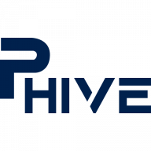
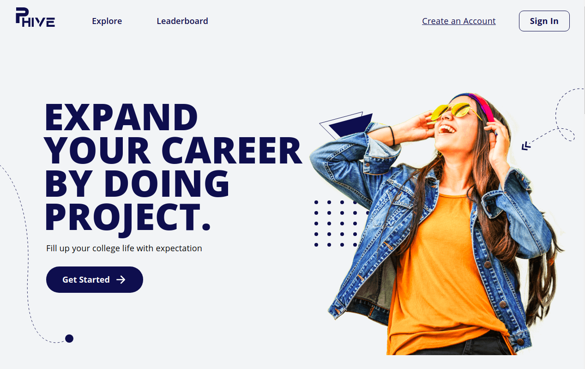

<!-- PROJECT SHIELDS -->
<!--
*** I'm using markdown "reference style" links for readability.
*** Reference links are enclosed in brackets [ ] instead of parentheses ( ).
*** See the bottom of this document for the declaration of the reference variables
*** for contributors-url, forks-url, etc. This is an optional, concise syntax you may use.
*** https://www.markdownguide.org/basic-syntax/#reference-style-links
-->
[![Contributors][contributors-shield]][contributors-url]
[![Forks][forks-shield]][forks-url]
[![Stargazers][stars-shield]][stars-url]
[![Issues][issues-shield]][issues-url]
[![MIT License][license-shield]][license-url]
[![LinkedIn][linkedin-shield]][linkedin-url]


<!-- PROJECT LOGO -->
<br />
<p align="center">
  <a href="https://github.com/ivqonsanada/phive">
    
  </a>

  <h3 align="center">PHive</h3>

  <p align="center">
    A kind of freelancing website for College
    <br />
    <a href="https://github.com/ivqonsanada/phive"><strong>Explore the docs »</strong></a>
    <br />
    <br />
    <a href="https://pkl-demo.ivqonsanada.com/">View Demo</a>
    ·
    <a href="https://github.com/ivqonsanada/phive/issues">Report Bug</a>
    ·
    <a href="https://github.com/ivqonsanada/phive/issues">Request Feature</a>
  </p>
</p>


<!-- TABLE OF CONTENTS -->
<details open="open">
  <summary><h2 style="display: inline-block">Table of Contents</h2></summary>
  <ol>
    <li>
      <a href="#about-the-project">About The Project</a>
      <ul>
        <li><a href="#built-with">Built With</a></li>
      </ul>
    </li>
    <li>
      <a href="#getting-started">Getting Started</a>
      <ul>
        <li><a href="#prerequisites">Prerequisites</a></li>
        <li><a href="#installation">Installation</a></li>
      </ul>
    </li>
    <!-- <li><a href="#usage">Usage</a></li> -->
    <li><a href="#roadmap">Roadmap</a></li>
    <li><a href="#contributing">Contributing</a></li>
    <li><a href="#license">License</a></li>
    <li><a href="#contact">Contact</a></li>
    <li><a href="#acknowledgements">Acknowledgements</a></li>
  </ol>
</details>


<!-- ABOUT THE PROJECT -->
## About The Project

[](https://pkl-demo.ivqonsanada.com)

A kind of freelancing website for College. Where Lecturer has project that he/she need help from Student to finish it. Student will get some kind of rewards like salary and/or certification. 

### Built With

* [Laravel](https://laravel.com/)
* [VueJS](https://vuejs.org/)
* [Sass](https://sass-lang.com/)

<!-- GETTING STARTED -->
## Getting Started

To get a local copy up and running follow these simple steps.

### Prerequisites

* [npm](https://nodejs.org/)
* [PHP](https://www.php.net/downloads)
* [composer](https://getcomposer.org/download/)
### Installation

1. Clone the repo
   ```sh
   git clone https://github.com/ivqonsanada/phive.git
   ```
2. Install NPM packages
   ```sh
   npm install
   ```
3. Install PHP packages
   ```sh
   composer install
   ```


<!-- USAGE EXAMPLES -->
<!-- ## Usage

1. Add L Application Key
   ```sh
   git clone https://github.com/ivqonsanada/phive.git
   ``` -->


<!-- ROADMAP -->
## Roadmap

See the [open issues](https://github.com/ivqonsanada/phive/issues) for a list of proposed features (and known issues).


<!-- CONTRIBUTING -->
## Contributing

Contributions are what make the open source community such an amazing place to be learn, inspire, and create. Any contributions you make are **greatly appreciated**.

1. Fork the Project
2. Create your Feature Branch (`git checkout -b feature/AmazingFeature`)
3. Commit your Changes (`git commit -m 'Add some AmazingFeature'`)
4. Push to the Branch (`git push origin feature/AmazingFeature`)
5. Open a Pull Request


<!-- LICENSE -->
## License

Distributed under the MIT License. See `LICENSE` for more information.


<!-- CONTACT -->
## Contact

Ivqonnada Al Mufarrih - [@ivqonsanada](https://twitter.com/ivqonsanada) - ivqonnada@gmail.com

Project Link: [https://github.com/ivqonsanada/phive](https://github.com/ivqonsanada/phive)


<!-- ACKNOWLEDGEMENTS -->
## Acknowledgements

* [Laravel-Vue SPA starter kit](https://github.com/cretueusebiu/laravel-vue-spa)


<!-- MARKDOWN LINKS & IMAGES -->
<!-- https://www.markdownguide.org/basic-syntax/#reference-style-links -->
[contributors-shield]: https://img.shields.io/github/contributors/ivqonsanada/phive.svg?style=for-the-badge
[contributors-url]: https://github.com/ivqonsanada/phive/graphs/contributors
[forks-shield]: https://img.shields.io/github/forks/ivqonsanada/phive.svg?style=for-the-badge
[forks-url]: https://github.com/ivqonsanada/phive/network/members
[stars-shield]: https://img.shields.io/github/stars/ivqonsanada/phive.svg?style=for-the-badge
[stars-url]: https://github.com/ivqonsanada/phive/stargazers
[issues-shield]: https://img.shields.io/github/issues/ivqonsanada/phive.svg?style=for-the-badge
[issues-url]: https://github.com/ivqonsanada/phive/issues
[license-shield]: https://img.shields.io/github/license/ivqonsanada/phive.svg?style=for-the-badge
[license-url]: https://github.com/ivqonsanada/phive/blob/master/LICENSE.txt
[linkedin-shield]: https://img.shields.io/badge/-LinkedIn-black.svg?style=for-the-badge&logo=linkedin&colorB=555
[linkedin-url]: https://linkedin.com/in/ivqonnada
