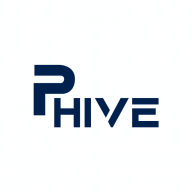

<p align="center">
  
</p>

<h1 align="center">PHive</h1>

<p align="center">
  A freelancing platform for college — lecturers publish real projects, students apply
  alone or with a party they recruit, and get paid and certified for finishing them.
</p>

<p align="center">
  <a href="#getting-started">Getting started</a> ·
  <a href="docs/DEPLOYMENT.md">Deployment</a> ·
  <a href="#roadmap">Roadmap</a> ·
  <a href="https://github.com/ivqonsanada/phive/tree/legacy">Legacy version</a>
</p>

---

## What this is

PHive started in 2020 as a Laravel 7 + Vue 2 monolith. This repository is the rewrite:
two independently deployable apps that talk over a JSON API.

```
phive/
├── backend/     Laravel 13 · PHP 8.3+ · PostgreSQL · Sanctum tokens
├── frontend/    Next.js 16 · React 19 · TypeScript · Tailwind 4
├── docs/        Deployment guide and assets
└── docker-compose.yml
```

The original code is preserved on the [`legacy`](https://github.com/ivqonsanada/phive/tree/legacy)
branch, untouched.

### Why two apps

The frontend is edge-deployable (Cloudflare Workers by default) while the API needs PHP
and a database. Splitting them lets each go where it runs best, and makes the API usable
by anything else you want to build later.

### How auth works

Sanctum **personal access tokens**, not stateful cookies — so the two apps never need to
share a root domain.

```
Browser ──▶ Next.js server action ──▶ POST /api/login ──▶ Laravel
                    │                                        │
                    │◀──────────── { user, token } ──────────┘
                    ▼
          httpOnly cookie (phive_token)
                    │
Browser ──▶ Next.js Server Component ──▶ Authorization: Bearer ──▶ Laravel
```

The token lives in an httpOnly cookie and is only ever read on the server, so client-side
JavaScript can never touch it. `src/proxy.ts` does a cheap cookie-presence check for
routing; `requireUser()` in `src/lib/dal.ts` is what actually verifies against the API.

---

## Getting started

**Requirements:** PHP 8.3+, Composer 2, Node 24+, pnpm 10+, PostgreSQL 14+.

```bash
git clone https://github.com/ivqonsanada/phive.git
cd phive
```

### Backend

```bash
cd backend
composer install
php artisan phive:install     # env file, app key, database, migrations, demo data
composer dev                  # serve + queue worker + log tail on :8000
```

`phive:install` asks which database to use and writes the credentials into `.env` for
you. Non-interactively (CI, containers):

```bash
php artisan phive:install --no-interaction-defaults --seed
```

Seeded accounts — password `password` for both:

| Email                 | Role     |
| --------------------- | -------- |
| `lecturer@phive.test` | Lecturer |
| `student@phive.test`  | Student  |

### Frontend

```bash
cd frontend
pnpm install
cp .env.example .env.local    # API_URL=http://localhost:8000
pnpm dev                      # :3000
```

### Everything at once

```bash
cp backend/.env.example backend/.env
docker compose up --build
```

---

## Development

| Task            | Backend                | Frontend         |
| --------------- | ---------------------- | ---------------- |
| Dev server      | `composer dev`         | `pnpm dev`       |
| Tests           | `php artisan test`     | —                |
| Lint / format   | `composer lint` (Pint) | `pnpm lint`      |
| Types           | —                      | `pnpm typecheck` |
| Production build| —                      | `pnpm build`     |

### A note on Next.js 16

Next 16 renamed `middleware.ts` to `proxy.ts` and made `cookies()` async. `frontend/AGENTS.md`
points at the version-accurate docs bundled in `node_modules/next/dist/docs/` — read those
rather than relying on older tutorials.

---

## API

Base URL `/api`. Authenticated routes expect `Authorization: Bearer <token>`.

**Reads** — these work for guests, but personalise themselves when a token is present
(for example `is_wished` only appears for a signed-in student):

| Method | Endpoint                       | Purpose                                          |
| ------ | ------------------------------ | ------------------------------------------------ |
| `GET`  | `/home`                        | Project counts, top of each board, latest projects |
| `GET`  | `/projects`                    | Explore + search: `?query=`, `?expertise=`, `?status=`, `?open_only=`, `?page=` |
| `GET`  | `/projects/{project_url}`      | Detail, with skills, requirements, team, review   |
| `GET`  | `/projects/{project_url}/similar` | Three related projects, matched to your expertise |
| `GET`  | `/users/{tagname}`             | Public profile plus that user's projects          |
| `GET`  | `/leaderboards`                | One ranked board per expertise                    |

**Auth and writes:**

| Method  | Endpoint                          | Auth | Purpose                           |
| ------- | --------------------------------- | ---- | --------------------------------- |
| `POST`  | `/register`                       | —    | Create an account, get a token    |
| `POST`  | `/login`                          | —    | Exchange credentials for a token  |
| `POST`  | `/logout`                         | ✓    | Revoke the calling token only     |
| `GET`   | `/user`                           | ✓    | The signed-in user                |
| `PATCH` | `/settings/password`              | ✓    | Change password, keep this device |
| `POST`  | `/password/email`                 | —    | Send a reset link                 |
| `POST`  | `/password/reset`                 | —    | Consume a reset token             |
| `GET`   | `/email/verify/{id}/{hash}`       | —    | Signed verification link          |
| `POST`  | `/email/resend`                   | ✓    | Resend the verification email     |
| `GET`   | `/wishlist`                       | ✓    | Projects the student starred      |
| `POST`  | `/projects/{project_url}/wishlist`| ✓    | Toggle a project on the wishlist  |
| `PATCH` | `/settings/profile`               | ✓    | Partial profile update, plus skills |
| `POST`  | `/settings/avatar` · `/settings/cv` | ✓  | Upload (multipart `file`)         |
| `DELETE`| `/settings/avatar` · `/settings/cv` | ✓  | Remove                            |
| `POST`  | `/settings/experiences`           | ✓    | Add a CV entry                    |
| `PATCH` `DELETE` | `/settings/experiences/{id}` | ✓ | Edit or remove your own entry  |
| `GET`   | `/party`                          | ✓    | The party you lead, and ones you're in |
| `POST`  | `/users/{tagname}/invite/party`    | ✓    | Invite a student to your party    |
| `DELETE`| `/party/members/{tagname}`        | ✓    | Remove a member                   |
| `DELETE`| `/party/{team}/leave`             | ✓    | Leave a party you don't lead      |
| `POST`  | `/projects/{project_url}/apply/individual` | ✓ | Apply on your own          |
| `POST`  | `/projects/{project_url}/apply/team` | ✓  | Apply with your party           |
| `DELETE`| `/projects/{project_url}/apply`   | ✓    | Withdraw your application         |
| `GET`   | `/inbox`                          | ✓    | Invitations and messages          |
| `POST`  | `/inbox/{id}/respond`             | ✓    | Accept or decline (`accept: bool`) |
| `POST`  | `/inbox/{id}/read`                | ✓    | Mark as read                      |
| `GET`   | `/project-box`                    | ✓    | Everything you're involved in     |
| `POST`  | `/project-box/{box}/confirm`      | ✓    | Take or decline a shortlisted seat |
| `GET`   | `/messages`                       | ✓    | Your conversations                |
| `GET` `POST` | `/messages/{tagname}`        | ✓    | Read or add to a thread           |

**Lecturer project management** — all require a lecturer token, and a policy scopes
every one of them to that lecturer's own projects. They live under `/my` so none of
them collide with the public `{project_url}` routes:

| Method   | Endpoint                             | Purpose                                  |
| -------- | ------------------------------------ | ---------------------------------------- |
| `GET`    | `/my/projects`                       | Own projects, drafts included            |
| `POST`   | `/my/projects`                       | Create — `publish: false` saves a draft  |
| `PATCH`  | `/my/projects/{project_url}`         | Edit; `publish: true` also publishes     |
| `POST`   | `/my/projects/{project_url}/publish` | Publish an existing draft as-is          |
| `POST`   | `/my/projects/{project_url}/close`   | Stop accepting applications              |
| `DELETE` | `/my/projects/{project_url}`         | Withdraw (blocked while ongoing)         |
| `POST`   | `/my/projects/{project_url}/thumbnail` | Upload a cover image (multipart `file`) |
| `DELETE` | `/my/projects/{project_url}/thumbnail` | Remove the cover image               |
| `GET` `POST` | `/my/projects/{project_url}/shortlist` | See applicants, and choose who goes through |
| `POST`   | `/my/projects/{project_url}/start`   | Start with whoever confirmed          |
| `GET` `POST` | `/my/projects/{project_url}/review` | Close out, score participants, award points |
| `POST`   | `/my/projects/{project_url}/invite/{tagname}` | Invite a student directly     |

Resource wrapping is off, so a resource is returned at the top level. Paginated
collections keep Laravel's `{ data, links, meta }` envelope.

Lecturer sign-ups are restricted to non-student academic addresses. That rule is
Indonesian-university-specific and lives in `config/phive.php` — change
`lecturer_email_pattern`, or set it to `null` to accept anything.

---

## Roadmap

The data model is fully ported (24 tables, typed Eloquent models, enums for every status
field). Progress so far:

- [x] Auth: register, login, logout, email verification, password reset and change
- [x] Projects: explore, search, filter by expertise, detail, similar projects, wishlist
- [x] Profiles: public view — finished work for students, published projects for lecturers
- [x] Leaderboard and home page stats
- [x] Publishing: draft, edit, publish, close applications, withdraw
- [x] Publishing extras: thumbnail upload
- [x] Profile editing: avatar and CV upload, skills, experiences
- [x] Inviting students to a project directly
- [x] Party recruitment and the inbox invitation flow
- [x] Applying: as an individual or with your party
- [x] Project box: shortlist, confirm, start, review and leaderboard points
- [x] Inbox and direct messaging

Everything the original app did is ported. Direct messages broadcast a
`MessageSent` event on the recipient's private channel — with
`BROADCAST_CONNECTION=log` that is a no-op, and pointing it at
[Reverb](https://laravel.com/docs/reverb) (which replaces the old Pusher setup)
makes them live without touching application code. The frontend currently reads
threads on request rather than subscribing; wiring Echo to that channel is the
remaining step for realtime delivery.

---

## License

MIT — see [LICENSE](LICENSE).
